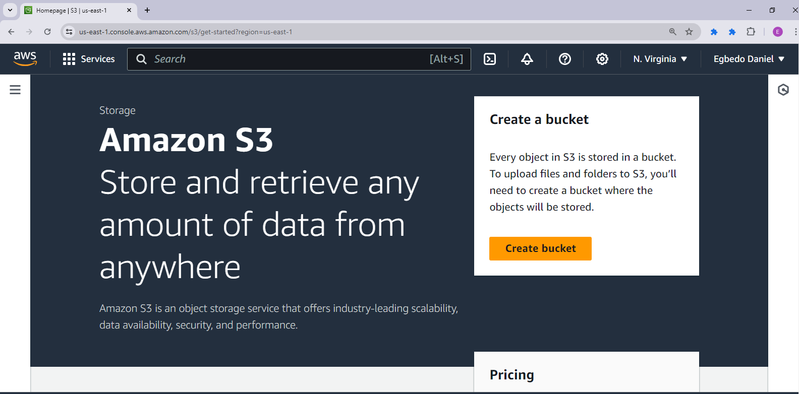
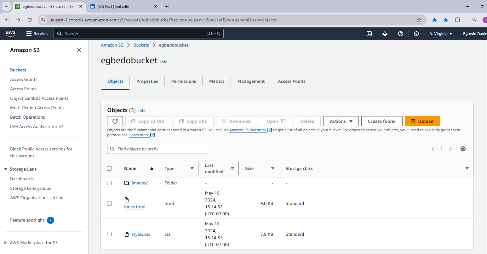
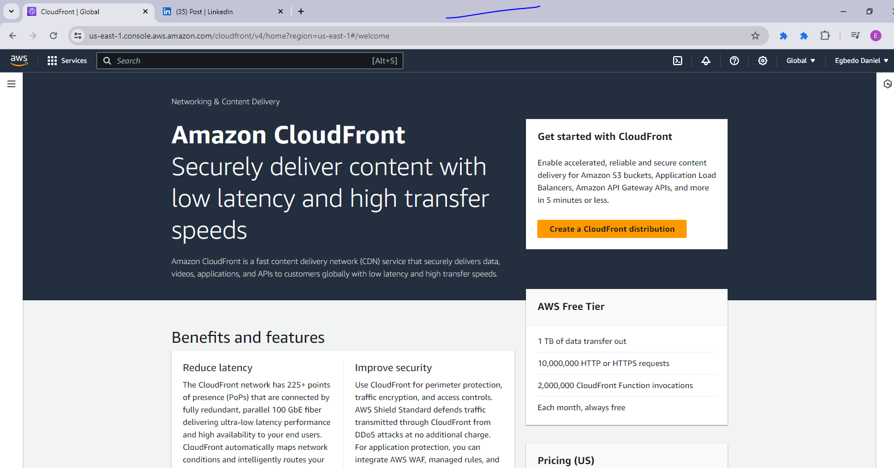

# create a static website and host it on S3 bucket(private bucket) but with public read policy assigned, using cloud front for CDN.

## Steps

1. I opened my amazon account and navigated to S3 bucket as shown in the image below
 and I clicked on create Bucket.

2. After creating the bucket, I uploaded my website files into the bucket root as shown below.

3. Ater Uploading, I went into another service called the cloudfront and created a distribution.

4. I edited my distributions with the appropraite settings and copied my policy into my s3 bucket. Then I went back into my cloudfront to get my dns address.

5. I copied the address, waited for the deployment to be over and I accessed my website with the address in the cloudfront page.

Those are the steps I took in hosting my static website on S3 bucket (private bucket)